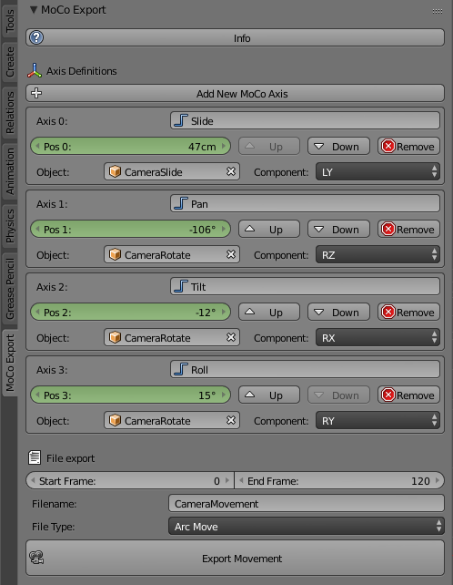

# BlenderMoco
This is a Blender addon to export motion control movement paths from Blender to Dragonframe. This allows a scene to be animated and previsualized in Blender, then finally executed in Dragonframe. Up to 32 axes of motion can be added. The value that is exported for each axis is determined by a reference to some object in the Blender scene and the relevent component of the object's position: location X/Y/Z or rotation X/Y/Z.

**How to use**

* To run the addon, open File -> User Preferences -> Addons -> Install Add-on from file -> Select the MoCoExportAddon.py file.
* Click "Add New MoCo Axis" to add a new axis. Each axis can be named for your reference. The addon panel appears in the tools panel in a "Moco Export" tab when in object mode.
* Select the object and component in the axis box. LX/LY/LZ are position components and RX/RY/RZ are rotation components.
* Axes can be organized by moving them up and down. The order they apear in will be order exported for Dragonframe.
* To animate the axes, animate the position values in the tool panel, do not animate the location and rotation values for the actual referenced object.
* To export, enter a filename and click the export button. The file will be saved to the same directory as the Blender project. In Dragonframe, import as a Raw Move file.

**Tips**

* To get an object to rotate with a pan/tilt/roll or heading/attitude/bank style, use the YXZ Euler rotation mode.
* The units of distance will match the units settings in the Blender scene. Be sure to match your Blender scene units to the units you want to use for your axes in Dragonframe.
* It can be very useful to parent referenced objects to other objects, so that the position being recorded is with respect to the parent object's origin, not the global origin. For example, parenting a slider block to a slider allows the slider to be positioned in any location and orientation in space, but the position of the slider block remains a relevant value that can be used for moco export. This is demonstrated in the example file.

**Known issues**

* There is an occasional issue in which an axis position does not update from the previous frame, yielding a "flat spot" of two identical position values in the Dragonframe export. If this happens, try exporting again or try restarting blender.

**Future work**

* Support for a focus axis that works for both digital lenses and geared lenses.
* Support for .arcmov XML export so the curves can be further modified once in Dragonframe.
